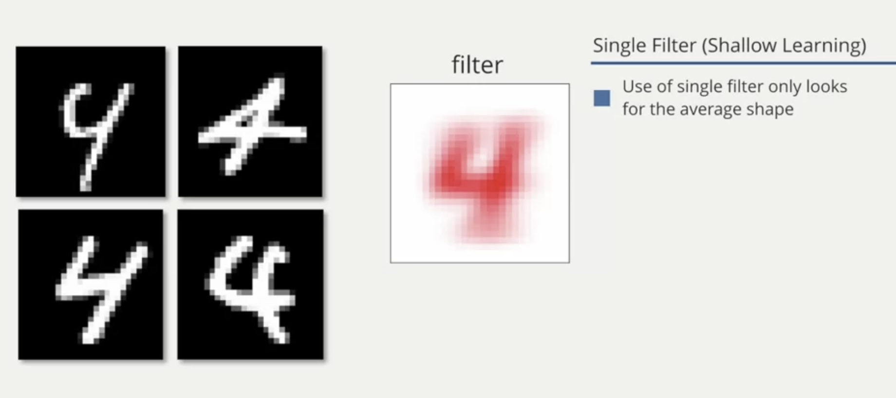
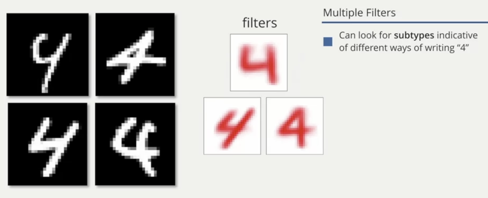

# Multilayer Perceptron

In logistic regression, the predictive model does a multiplication of each feature with parameters, sum all together with a constant value (bias) and use this result as the input for the sigmoid function to have the probability outcome.

In the multilayer perceptron, the predictive model does this same process K times.


This model gets the data and generates a vector of Zi from 1 to K, pass each Zi into the sigmoid function to get the first outcome called "the probability of K latent processes/features".


And then each latent feature (also called `filters`) is used as the input for a logistic regression model to generate a binary probability of a particular outcome.

### Example: Handwritten numbers

For handwritten number 4, we can have different examples of it. With a single filter, it gives an average number 4 (average shape). This is a shallow learning because the average 4 can have different examples in the data that may not look like the average number.



So building a classifier based on a single filter seems undesirable.

We can consider a model to have three (or multiple) intermediate filters.



In this case, the data is the pixels of the image of each handwritten number 4, it applies K filters, in this case K = 3, and then it generates the probability outcome based on the 3 filters (is it the number 4 or not?).

```
(b11 * Xi1) + (b12 * Xi2) + ... + (b1m * Xim) + b01 = Zi1
(b21 * Xi1) + (b22 * Xi2) + ... + (b2m * Xim) + b02 = Zi2
                            ...
(bK1 * Xi1) + (bK2 * Xi2) + ... + (bKm * Xim) + b0K = ZiK
```

This intermediate model adds more sofistication and flexibility to the predictive model. It allows us consider non-linear decision boundaries in feature space and in most cases more effective than a simple logistic regression.
